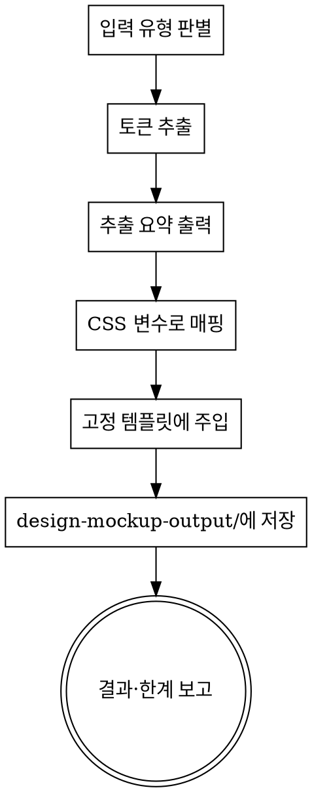

# design-mockup

소스(HTML 파일 · 이미지 · 페이지 URL)에서 디자인 토큰을 추출하고, 그 토큰으로 입힌 **고정 샘플 화면 세트**를 self-contained HTML 한 장으로 생성한다. "이 디자인으로 만들면 실제로 이렇게 보이겠구나"를 미리보기 하는 용도다.

이 스킬은 프로젝트 특정 값을 담지 않는다. 어느 프로젝트에 복사해도 동일하게 동작한다.

## When to use

- HTML 파일/이미지/URL을 주고 "이 디자인으로 목업 만들어줘", "토큰 뽑아줘", "이 스타일로 미리보기" 라고 할 때.
- 어떤 사이트/시안의 룩앤필을 빠르게 동작하는 화면으로 확인하고 싶을 때.

## 입력 유형 판별

- 경로가 `.html`/`.htm` → **HTML 파일**
- 경로가 이미지 확장자(`.png`/`.jpg`/`.jpeg`/`.webp`/`.gif`) → **이미지**
- `http://` 또는 `https://`로 시작 → **URL**

## 절차



### 1단계 — 토큰 추출 (유형별)

**HTML 파일**: Read로 파일을 읽고 인라인 `<style>`, `style=` 속성, 그리고 같은 폴더에서 `<link rel="stylesheet">`로 연결된 `.css`를 함께 읽는다. 색·폰트·간격·라운드·그림자 값을 모은다.

**이미지**: Read로 이미지를 직접 보고 색·폰트 느낌·간격·라운드를 **육안 추정**한다. CSS가 없으므로 추출 요약과 결과에 "추정치(estimated)"로 명시한다. 폰트는 이미지에서 폰트 패밀리를 단정할 수 없으므로 특정 서체를 지어내지 말고 템플릿 기본값(`--font-family`)을 유지한다(세리프/산세리프 정도의 큰 구분만 반영).

**URL**: Bash `curl`로 원본 HTML을 받고, 그 안의 `<link rel="stylesheet">` href를 따라 CSS 파일도 받아 파싱한다.

```bash
# 원본 HTML
curl -sL "<URL>" -o /tmp/dm-page.html
# (HTML 안의 stylesheet href를 확인해 절대 URL로 추가 fetch)
curl -sL "<CSS_URL>" -o /tmp/dm-style.css
```

**한계**: JS로 동적 생성되는 스타일은 curl로 못 받는다 → 결과에 명시한다.

### 2단계 — 추출 원칙

- **관찰·빈도 기반, 발명 금지.** 가장 자주 등장하는 값을 canonical로 택한다.
- CSS 커스텀 프로퍼티(`--foo`)나 테마 파일이 있으면 그것을 1차 근거로 삼는다.
- 다음 역할로 정리한다(없으면 가까운 값으로 추정하고 그 사실을 표기):
  - 색: `primary`, `surface`(배경), `text`, `border`, `accent` (구분되는 강조색이 없으면 `accent`는 `primary`와 동일하게 둔다)
  - 타이포: `font-family`, 본문 `font-size`, 제목 `font-size`, `font-weight`(보통/굵게)
  - 간격: 대표 간격 1~2개(예: `8px`, `16px`)
  - 라운드: 대표 `border-radius`
  - 그림자: 대표 `box-shadow`

### 3단계 — 추출 요약 출력

추출한 토큰을 표로 사용자에게 보여준다. 각 값의 출처(파일/이미지 추정/URL)와 불확실 여부를 함께.

### 4단계 — 고정 템플릿에 주입

아래 템플릿의 `:root` 변수만 추출값으로 치환한다. **마크업 구조는 바꾸지 않는다**(결과 일관성 유지). 폰트가 웹폰트면 `<head>`에 해당 폰트의 CDN `<link>`를 추가해도 된다(Google Fonts에 없는 폰트는 정확한 CDN을 쓴다 — 예: Pretendard는 jsdelivr).

### 5단계 — 저장 & 보고

- 저장 위치: 실행 시점 cwd 기준 `design-mockup-output/`. 디렉터리가 없으면 생성한다. **위치는 묻지 않는다.**
- 파일명: `mockup-<source-slug>.html` (source-slug = 소스 파일명 또는 URL 호스트의 안전한 슬러그).
- 저장 후 절대경로, 추출 요약, 한계(이미지=추정 / URL=JS 누락 가능)를 보고한다.

## 고정 템플릿 (이 구조를 그대로 쓰고 `:root` 변수만 치환)

```html
<!doctype html>
<html lang="ko">
<head>
<meta charset="utf-8">
<meta name="viewport" content="width=device-width, initial-scale=1">
<title>Design Mockup</title>
<style>
:root {
  --color-primary: #2660c3;
  --color-surface: #ffffff;
  --color-bg: #f4f6fa;
  --color-text: #1f2330;
  --color-border: #e2e6ee;
  --color-accent: #2660c3;
  --font-family: system-ui, -apple-system, "Segoe UI", Roboto, sans-serif;
  --font-size-base: 14px;
  --font-size-title: 20px;
  --weight-normal: 400;
  --weight-bold: 700;
  --space-sm: 8px;
  --space-md: 16px;
  --radius: 8px;
  --shadow: 0 1px 3px rgba(0,0,0,.12);
}
* { box-sizing: border-box; }
body { margin:0; background:var(--color-bg); color:var(--color-text);
  font-family:var(--font-family); font-size:var(--font-size-base);
  font-weight:var(--weight-normal); }
.wrap { max-width: 960px; margin: 0 auto; padding: var(--space-md); }
h1,h2 { font-weight:var(--weight-bold); }
.legend { background:var(--color-surface); border:1px solid var(--color-border);
  border-radius:var(--radius); box-shadow:var(--shadow); padding:var(--space-md);
  margin-bottom:var(--space-md); }
.legend h2 { margin-top:0; font-size:var(--font-size-title); }
.swatches { display:flex; gap:var(--space-md); flex-wrap:wrap; }
.swatch { text-align:center; font-size:12px; }
.swatch i { display:block; width:56px; height:56px; border-radius:var(--radius);
  border:1px solid var(--color-border); margin-bottom:4px; }
.card { background:var(--color-surface); border:1px solid var(--color-border);
  border-radius:var(--radius); box-shadow:var(--shadow); padding:var(--space-md);
  margin-bottom:var(--space-md); }
.btn { font:inherit; padding:var(--space-sm) var(--space-md); border-radius:var(--radius);
  border:1px solid var(--color-primary); cursor:pointer; }
.btn-primary { background:var(--color-primary); color:#fff; }
.btn-ghost { background:transparent; color:var(--color-primary); }
table { width:100%; border-collapse:collapse; }
th,td { text-align:left; padding:var(--space-sm); border-bottom:1px solid var(--color-border); }
th { font-weight:var(--weight-bold); }
.field { display:block; margin-bottom:var(--space-sm); }
.field label { display:block; margin-bottom:4px; }
.field input,.field select { width:100%; padding:var(--space-sm);
  border:1px solid var(--color-border); border-radius:var(--radius); font:inherit; }
.modal { max-width:420px; }
.modal .actions { display:flex; gap:var(--space-sm); justify-content:flex-end;
  margin-top:var(--space-md); }
</style>
</head>
<body>
<div class="wrap">

  <section class="legend">
    <h2>Design Tokens</h2>
    <div class="swatches">
      <span class="swatch"><i style="background:var(--color-primary)"></i>primary</span>
      <span class="swatch"><i style="background:var(--color-accent)"></i>accent</span>
      <span class="swatch"><i style="background:var(--color-surface)"></i>surface</span>
      <span class="swatch"><i style="background:var(--color-bg)"></i>bg</span>
      <span class="swatch"><i style="background:var(--color-text)"></i>text</span>
      <span class="swatch"><i style="background:var(--color-border)"></i>border</span>
    </div>
    <p style="margin-bottom:0">Font: var(--font-family) · base var(--font-size-base) ·
       radius var(--radius) · shadow var(--shadow)</p>
  </section>

  <section class="card">
    <h2>Dashboard</h2>
    <button class="btn btn-primary">주요 동작</button>
    <button class="btn btn-ghost">보조 동작</button>
  </section>

  <section class="card">
    <h2>Data Table</h2>
    <table>
      <thead><tr><th>이름</th><th>부서</th><th>상태</th></tr></thead>
      <tbody>
        <tr><td>홍길동</td><td>개발</td><td>활성</td></tr>
        <tr><td>김철수</td><td>영업</td><td>대기</td></tr>
      </tbody>
    </table>
  </section>

  <section class="card">
    <h2>Form</h2>
    <span class="field"><label>이름</label><input placeholder="이름 입력"></span>
    <span class="field"><label>부서</label>
      <select><option>개발</option><option>영업</option></select></span>
    <button class="btn btn-primary">저장</button>
  </section>

  <section class="card modal">
    <h2>Modal</h2>
    <p>변경사항을 저장하시겠습니까?</p>
    <div class="actions">
      <button class="btn btn-ghost">취소</button>
      <button class="btn btn-primary">확인</button>
    </div>
  </section>

</div>
</body>
</html>
```

## 정직성 & 범위

- 코드에 없는 토큰을 지어내지 않는다. 빈도가 불분명하면 "불확실"이라 말하고 가장 가까운 값을 쓴다.
- 이미지 입력은 추정치임을 항상 명시한다. URL 입력은 JS 동적 스타일 누락 가능성을 명시한다.
- 마크업 템플릿 구조는 바꾸지 않는다. `:root` 변수만 치환한다(일관성).
- 이 스킬은 원본 픽셀 재현이나 화면 분기를 하지 않는다. 고정 샘플 세트 1종만 생성한다.
