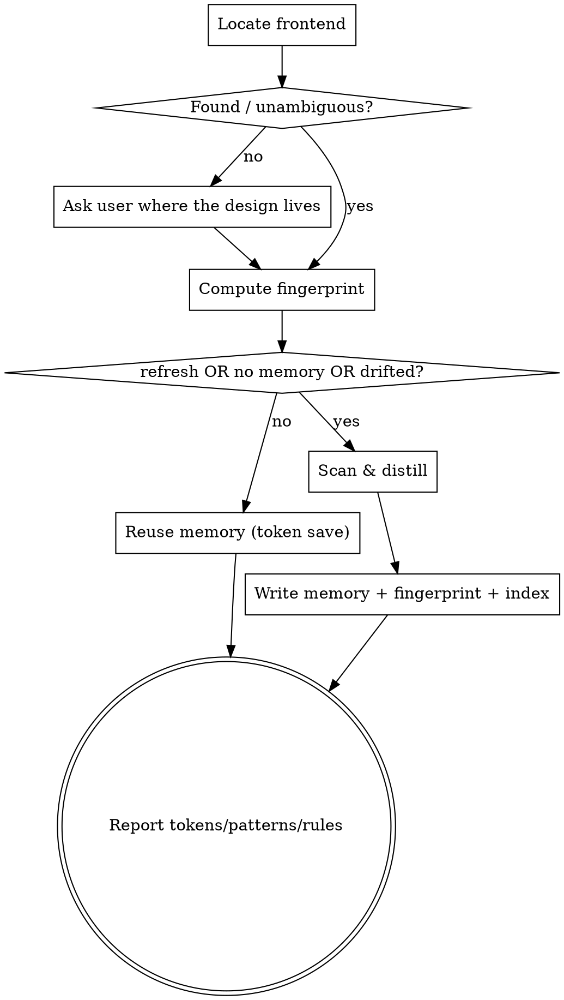

# view-memory

Keep new frontend visually consistent with what already exists, while spending as few tokens as possible. Instead of re-reading dozens of stylesheets every session, this skill distills the project's design system into a few small memory files once, refreshes them only when the frontend changes, and consults them when building new UI.

The skill contains **no project-specific values**. It learns each project's design system at run time, so the same skill works in any project and any frontend stack.

## When to use

- Before building or editing any UI (screen, page, component, modal, form, table) — load the design system from memory so the new work matches.
- When asked to "learn / index / remember the design system" — do a full scan and write memory.
- When the design system changed and memory is stale — pass `refresh` to force a re-scan.

## Modes

- **default** — fingerprint-gated. Reuse memory if the frontend is unchanged; re-scan only if it drifted or memory is missing. This is the token-saving path.
- **refresh** — force a full re-scan and rewrite memory, ignoring the fingerprint. Use after a redesign.

## Procedure

### Step 1 — Locate the frontend (loose, stack-agnostic)

Discover where styles and components live. Do not assume a stack — observe the project:

- Style files: `**/*.css`, `**/*.scss`, `**/*.less`
- Component/template files: `**/*.html`, `**/*.jsx`, `**/*.tsx`, `**/*.vue`, `**/*.svelte`, server-side templates
- Stack signals: `tailwind.config.*`, `package.json` dependencies (react/vue/svelte/tailwind), CSS-variable theme files, design-token files
- A directory that clearly holds shared/common styles (names like `common`, `design-system`, `theme`, `tokens`, `shared`)

Record the set of frontend directories you will treat as the design system. **If you cannot find a frontend, or it is genuinely ambiguous which directories are canonical, stop and ask the user — do not guess.**

### Step 2 — Compute a fingerprint

Over the frontend directories from Step 1 only, compute a cheap fingerprint that changes when the design changes. Prefer, in order:

1. `git log -1 --format=%H -- <frontend dirs>` (last commit touching those dirs), if the project is a git repo.
2. Otherwise: count of style files + the newest modification time among them.

### Step 3 — Compare against memory

Read the fingerprint stored in the `view-fingerprint` memory file (if present).

- **Unchanged** (and not `refresh`) → skip scanning. Load the existing `view-*` memory files and go to Step 6. This is the token-saving hit — report that the design system is current.
- **Drifted, missing, or `refresh`** → continue to Step 4.

### Step 4 — Scan & distill (only when needed)

Extract by **observation and frequency**, never by invention. Three layers:

**Tokens** — the raw visual values:
- Colors (hex / rgb / hsl), spacing (px / rem), font sizes and weights, border-radius, shadows.
- If the project uses CSS custom properties (`--foo`) or a `tailwind.config` / theme file, treat those as the authoritative source.
- Otherwise grep the style files and pick the **most frequent** values as canonical (e.g. the primary color is the brand color that recurs across files, not a one-off).

**Patterns** — the reusable components:
- Identify recurring components: table, modal, button, form, sidebar/nav, search, card, pagination, etc.
- For each, record only: the **class name(s)**, the **file that defines it** (`path`), and a **minimal usage snippet**. Do not copy whole CSS blocks — store pointers, not the stylesheet.

**Rules** — how to build a new screen consistently:
- Which stylesheets/scripts a typical page imports (the common/base set).
- File naming conventions (prefixes, casing, folder layout).
- Where new templates/components and their styles go.

### Step 5 — Write memory

Write to the project's memory directory using the existing memory convention (one fact per file, plus a one-line pointer in `MEMORY.md`). Files:

| File | metadata.type | Content |
|---|---|---|
| `view-tokens.md` | reference | Canonical colors, spacing, font sizes/weights, radius, shadows |
| `view-patterns.md` | reference | Common components: class names, defining file path, minimal snippet |
| `view-conventions.md` | reference | Import set, naming conventions, file locations for new screens |
| `view-fingerprint.md` | project | The fingerprint value, scan timestamp, and the list of scanned directories |

Add four pointer lines to `MEMORY.md` (one per file). Link the three reference files to each other and to `view-fingerprint` with `[[name]]` links. If a `view-*` file already exists, update it in place rather than duplicating.

Each `view-*` memory file must cite where its facts came from (`file:line` or directory) so they can be re-verified — consistent with the project's verify-before-claiming rule.

### Step 6 — Report

Output a short summary of the tokens, patterns, and rules now in memory. Subsequent UI work follows these without re-reading the full stylesheet set.

## Honesty & scope

- Never invent tokens or patterns that aren't in the code. If frequency is unclear, say so and ask.
- Store pointers (class name + file path + small snippet), not whole stylesheets — that is what keeps later sessions cheap.
- Stay within frontend discovery and memory writing. This skill does not restyle existing code or build features on its own.
